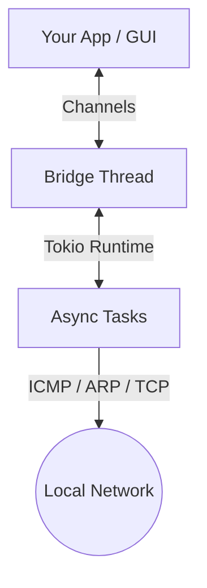

# 🚀 ragescanner

[](LICENSE)
[](https://github.com/wends155/ragescanner/actions)

A high-performance, asynchronous IP scanner for Windows built with **Rust**, **native-windows-gui (NWG)**, and **Tokio**.

Available as both a **GUI Application** and a **Developer Library**.

## ✨ Features
- **Fast Scanning**: Leverages Tokio to perform thousands of concurrent pings and port checks.
- **Unprivileged ICMP**: Uses `IcmpSendEcho` API to scan without requiring Administrator rights.
- **Device Identification**:
    - Resolves MAC addresses using `SendARP` (unprivileged).
    - Identifies manufacturers using a local OUI database.
    - Resolves hostnames via DNS and NetBIOS.
- **Native UI**: Built with `native-windows-gui` for a lightweight Windows experience.
- **Developer API**: Simple channel-based bridge for integration into high-performance TUIs or CLI tools.

## 📦 Installation

### As an Application
Download the latest release from the [Releases](https://github.com/wends155/ragescanner/releases) page and run `ragescanner.exe`.

### As a Library
Add to your `Cargo.toml`:
```toml
[dependencies]
ragescanner = { git = "https://github.com/wends155/ragescanner" }
```

## 💻 Library Usage

```rust
use ragescanner::bridge::Bridge;
use ragescanner::types::BridgeMessage;
use std::net::Ipv4Addr;

#[tokio::main]
async fn main() {
    let bridge = Bridge::new();
    
    // Start scan using the typed IP API
    bridge.cmd_tx.send(BridgeMessage::StartScanRange(
        Ipv4Addr::new(192, 168, 1, 1),
        Ipv4Addr::new(192, 168, 1, 255)
    )).await.expect("Failed to send command");

    // Receive results asynchronously
    while let Ok(msg) = bridge.ui_rx.recv() {
        match msg {
            BridgeMessage::ScanUpdate(res) => {
                println!("[{}] {} - Ports: {:?}", res.ip, res.status, res.open_ports);
            }
            BridgeMessage::Progress(p) => println!("Progress: {}%", p),
            BridgeMessage::ScanComplete => break,
            _ => {}
        }
    }
}
```

## 🛠️ Build & Development
Requires **Rust (2024 Edition)** and **MSVC** toolchain.

```bash
cargo run           # Launch GUI
cargo run --example tui_poc  # Run the TUI proof-of-concept
cargo test          # Run unit and doc-tests
```

## 🏗️ Architecture


## ⚖️ License
MIT License. See [LICENSE](LICENSE) for details.
