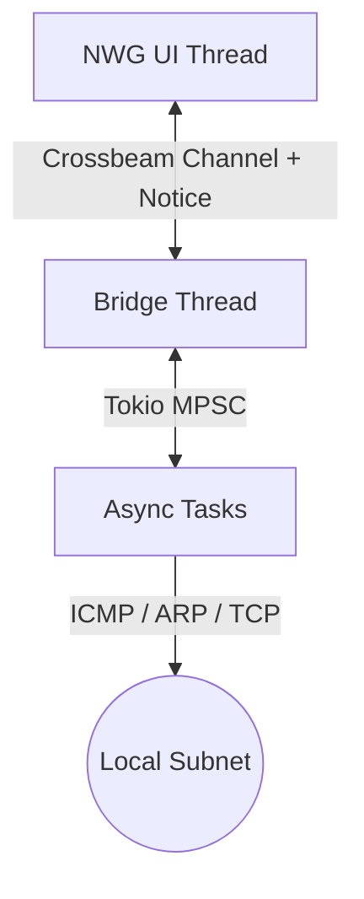

# 🚀 ragescanner

A high-performance, asynchronous IP scanner for Windows built with **Rust**, **native-windows-gui (NWG)**, and **Tokio**.

## ✨ Features
- **Hybrid Architecture**: Uses a dedicated bridge thread to coordinate between the synchronous Win32 UI and the asynchronous Tokio runtime.
- **Fast Scanning**: Leverages Tokio's task spawning to perform thousands of concurrent pings and port checks.
- **Unprivileged ICMP**: Uses the Windows `IcmpSendEcho` API via `ping-async` to allow scanning without Administrator rights.
- **Device Identification**:
    - Resolves MAC addresses using `SendARP` (unprivileged).
    - Identifies vendors using a local OUI database.
    - Heuristic-based device type detection (Workstation, IoT, Mobile, etc.).
- **Native Look & Feel**: Built with `native-windows-gui` for a lightweight, performant, and consistent Windows experience.

## 🏗️ Architecture


## 🛠️ Build & Development
Requires **Rust (2024 Edition)** and **MSVC** toolchain.

```bash
make build  # Compile release binary
make run    # Compile and run
make test   # Run unit tests
make verify # Run linter and formatting checks
```

## ⚖️ License
MIT License. See [LICENSE](LICENSE) for details.
