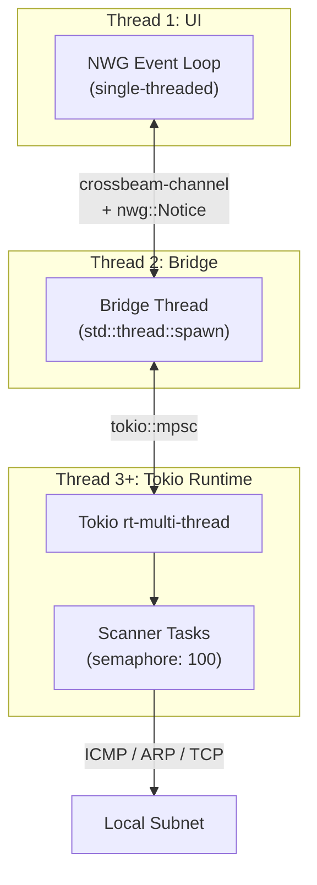
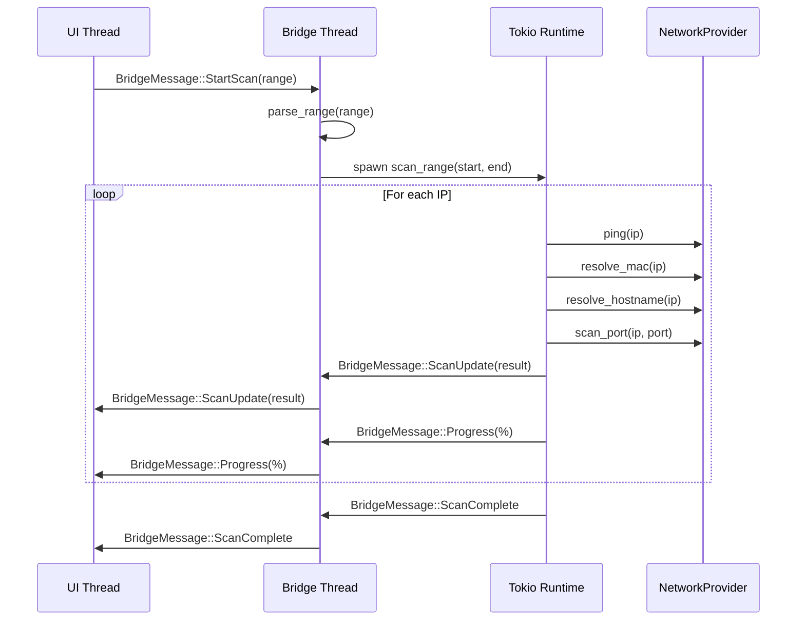

# 🏗️ Architecture: RageScanner

> **Technical Source of Truth** — This file concretizes all `<!-- CUSTOMIZE -->` markers in [GEMINI.md](file:///c:/Users/WSALIGAN/code/ragescanner/GEMINI.md).

---

## 1. Project Overview

**RageScanner** is a high-performance, asynchronous IP and port scanner for Windows, built with Rust, Native Windows GUI (NWG), and Tokio.

**Core Capabilities:**
- ICMP Ping via unprivileged Win32 `IcmpSendEcho` API
- ARP-based MAC address resolution via `SendARP`
- OUI vendor identification from a local database
- Reverse DNS hostname resolution via OS system resolver
- TCP port scanning on 16 common ports
- Real-time GUI updates during scans

---

## 2. Language & Runtime

| Property | Value |
|:---|:---|
| Language | Rust |
| Edition | **2024** |
| Target Triple | `x86_64-pc-windows-msvc` |
| Toolchain | MSVC (Portable, via Scoop) |
| MSRV | Latest stable (not pinned) |
| Async Runtime | Tokio (multi-threaded, `rt-multi-thread`) |
| GUI Runtime | NWG single-threaded Win32 event loop |

---

## 3. Project Layout

```
ragescanner/
├── src/
│   ├── main.rs          # Entry point, logging init, panic hook
│   ├── bridge.rs        # UI↔Async bridge orchestrator
│   ├── net.rs           # Network primitives (ping, ARP, DNS, ports)
│   ├── scanner.rs       # Async scan engine with semaphore concurrency
│   ├── types.rs         # Shared types: GError, ScanResult, BridgeMessage
│   └── ui.rs            # NWG GUI layout, ListView, event handlers
├── scripts/
│   └── verify.sh        # Quality gate script (fmt + clippy + test + check)
├── reference/           # Reference materials and templates
├── Cargo.toml           # Package manifest
├── Makefile             # Build shortcuts (check, build, run, test, verify)
├── GEMINI.md            # Workflow rules (Operational Source of Truth)
├── architecture.md      # This file (Technical Source of Truth)
└── context.md           # Decision history (Contextual Source of Truth)
```

---

## 4. Toolchain

| Tool | Command | Purpose |
|:---|:---|:---|
| **Formatter** | `cargo fmt -- --check` | Enforce consistent code style |
| **Linter** | `cargo clippy -- -D warnings` | Catch common mistakes, warnings-as-errors |
| **Tests** | `cargo test` | Run all unit tests |
| **Build Check** | `cargo check` | Fast compilation check |
| **Full Verify** | `sh scripts/verify.sh` | Runs all of the above in sequence |
| **Release Build** | `cargo build --release` | Optimized production binary |

### Verification Script

**Path:** `scripts/verify.sh`

```sh
#!/bin/sh
set -e
echo "Running Format Check..." && cargo fmt -- --check
echo "Running Linter..."       && cargo clippy -- -D warnings
echo "Running Tests..."        && cargo test
echo "Running Build Check..."  && cargo check
```

> [!NOTE]
> In PowerShell, run commands sequentially (no `&&` chaining). Use `make verify` or `sh scripts/verify.sh` via BusyBox.

---

## 5. Error Handling Strategy

### Custom Error Type: `GError`

Defined in [types.rs](file:///c:/Users/WSALIGAN/code/ragescanner/src/types.rs):

```rust
pub enum GError {
    Win32(u32, String),   // Win32 API error code + descriptor
    Internal(String),     // Application-level error
}
```

### Patterns

| Pattern | Usage |
|:---|:---|
| `Result<T, GError>` | All fallible network operations (`ping`, `resolve_mac`, `resolve_hostname`) |
| `Display` impl | User-facing messages: `"Win32 Error (code): msg"` / `"Internal Error: msg"` |
| RAII `SafeHandle` | Win32 `HANDLE` wrapper in `net.rs` — auto-closes via `Drop` |
| Panic Hook | `main.rs` catches panics → logs + Win32 `MessageBoxA` |
| No panics in lib | Library code returns `Result`, never `unwrap()`/`panic!()` on fallible paths |

---

## 6. Observability & Logging

| Property | Value |
|:---|:---|
| **Facade** | `log` crate (macros: `info!`, `warn!`, `error!`, `debug!`) |
| **Backend** | `simplelog::WriteLogger` |
| **Output** | File: `ragescanner.log` (fallback: `ragescanner.err`) |
| **Default Level** | `Debug` |

### Log Level Usage

| Level | When |
|:---|:---|
| `info!` | Scan lifecycle: start, per-IP result, completion |
| `warn!` | Non-fatal Win32 errors (e.g., `SendARP` unexpected `mac_len`) |
| `error!` | System errors during scanning, unrecoverable panic messages |

### Log Access
```powershell
Get-Content ragescanner.log -Tail 50
```

---

## 7. Testing Strategy

| Aspect | Detail |
|:---|:---|
| **Framework** | Built-in `#[cfg(test)]` + `#[test]` / `#[tokio::test]` |
| **Placement** | Co-located `mod tests` blocks within each source file |
| **Mocking** | Manual `MockNet` struct in `net.rs` implementing `NetworkProvider` trait |
| **Dev-Deps** | `rand = "0.8"` (randomized property tests in `bridge.rs`) |
| **Run Command** | `cargo test` |

### Test Coverage

| Module | Tests | Type |
|:---|:---|:---|
| `bridge.rs` | `test_parse_single_ip`, `test_parse_octet_range`, `test_parse_full_range`, `test_parse_invalid`, `test_parse_ui_generated_range_randomized` | Unit + Property |
| `net.rs` | `test_resolve_mac_safety` | Regression |
| `scanner.rs` | `test_scanner_with_ports_and_progress` | Integration (`#[tokio::test]`) |

### Mocking Pattern

The `NetworkProvider` trait in `net.rs` abstracts all network I/O:

```rust
pub trait NetworkProvider: Send + Sync {
    fn ping(&self, ip: Ipv4Addr) -> Result<bool, GError>;
    fn resolve_mac(&self, ip: Ipv4Addr) -> Result<Option<String>, GError>;
    fn resolve_hostname(&self, ip: Ipv4Addr) -> Result<Option<String>, GError>;
    fn resolve_vendor(&self, mac: &str) -> Option<String>;
    fn scan_port(&self, ip: Ipv4Addr, port: u16) -> BoxFuture<'_, bool>;
}
```

`MockNet` implements this trait under `#[cfg(test)]` to enable deterministic scanner tests without network access.

---

## 8. Documentation Conventions

| Convention | Format |
|:---|:---|
| **Public items** | Rustdoc `///` comments |
| **Module-level** | `//!` at file top (to be adopted incrementally) |
| **Doc generation** | `cargo doc --no-deps` |

### Required Doc Structure
- **Description:** What the function/type does
- **Parameters:** Each parameter's purpose
- **Returns:** Return value semantics
- **Errors:** Conditions under which it returns `Err`

---

## 9. Dependencies & External Systems

### Runtime Dependencies

| Crate | Version | Purpose |
|:---|:---|:---|
| `native-windows-gui` | 1.0.13 | Win32 GUI framework |
| `native-windows-derive` | 1.0.3 | NWG derive macros |
| `tokio` | 1.36 | Async runtime (`rt-multi-thread`, `macros`, `sync`, `time`, `net`) |
| `windows` | 0.52 | Win32 FFI (`IpHelper`, `Foundation`, `WinSock`, `WindowsAndMessaging`) |
| `mac_oui` | 0.4 | OUI vendor lookup (with embedded DB) |
| `dns-lookup` | 2.0 | Reverse DNS via system resolver (`getnameinfo`) |
| `log` | 0.4 | Logging facade |
| `simplelog` | 0.12 | File-based log backend |
| `crossbeam-channel` | 0.5 | MPMC channels for UI↔Bridge communication |
| `serde` | 1.0 | Serialization (with `derive`) |
| `lazy_static` | 1.4 | Lazy-initialized OUI database singleton |

### Dev Dependencies

| Crate | Version | Purpose |
|:---|:---|:---|
| `rand` | 0.8 | Randomized property-based tests |

### External Systems
- **Windows OS resolver** — DNS hostname resolution delegated to `getnameinfo` (see [AUDIT_HOSTNAME.md](file:///c:/Users/WSALIGAN/code/ragescanner/AUDIT_HOSTNAME.md))
- **Local subnet** — ICMP, ARP, and TCP probes target the local network

---

## 10. Architecture Diagrams

### System Architecture (Three-Thread Model)



### Scan Data Flow



---

## 11. Known Constraints & Bugs

| Constraint | Detail |
|:---|:---|
| **Windows-only** | Win32 API dependencies (`IcmpSendEcho`, `SendARP`, `MessageBoxA`) |
| **No admin required** | Uses unprivileged ICMP via `IcmpSendEcho` API |
| **OS resolver** | Hostname resolution delegates to Windows system resolver; follows hosts file → DNS → LLMNR/NetBIOS order (see [AUDIT_HOSTNAME.md](file:///c:/Users/WSALIGAN/code/ragescanner/AUDIT_HOSTNAME.md)) |
| **Concurrency cap** | Semaphore-limited to 100 concurrent scan tasks |
| **GUI responsiveness** | Bridge pattern decouples NWG's single-threaded loop from async work to prevent UI freezes |
| **Port scan scope** | Fixed list of 16 common ports; not yet user-configurable |
