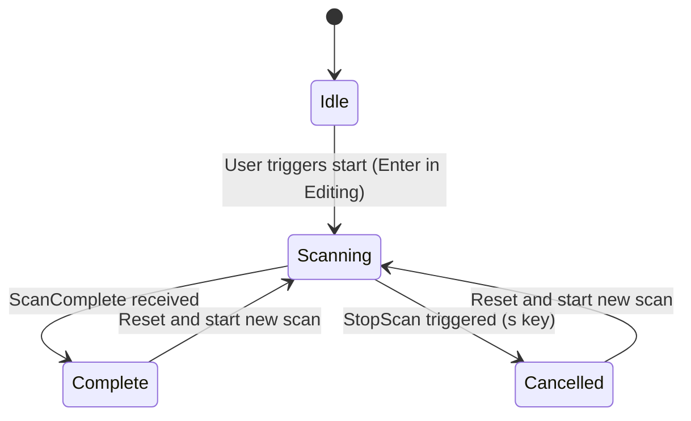
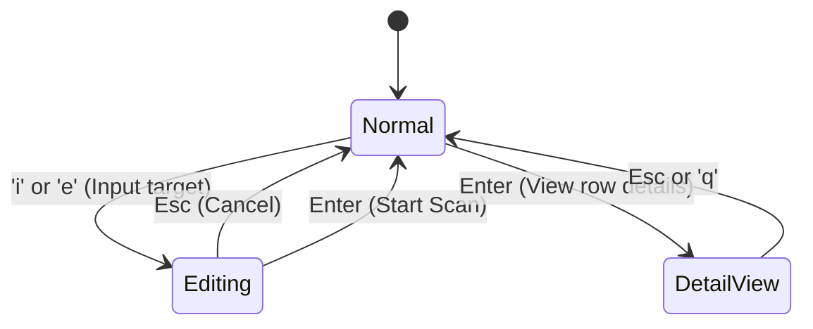

# RageScanner Specification — Behavioral Source of Truth

This document defines the behavioral contracts, data models, and invariants of the `ragescanner` library. It serves as the authoritative source for "how the system should behave" (Behavioral Source of Truth), complementing `architecture.md` (Technical Source of Truth).

---

## 1. Module Contracts

### `types` — Shared Types & Constants
| Item | Signature | Invariants |
|------|-----------|------------|
| `GError` | `enum { Win32(u32, String), Internal(String) }` | Implements `Display`, `Clone`, `PartialEq`, `Eq`. |
| `ScanStatus` | `enum { Scanning, Online, Offline, SystemError(GError) }` | Implements `Display`, `Clone`, `PartialEq`, `Eq`. |
| `ScanResult` | `struct { ip, hostname, mac, vendor, status, open_ports }` | `new(ip)` initializes with `Scanning` status and empty fields. |
| `BridgeMessage` | `enum { StartScan, StartScanRange, StopScan, ScanUpdate, ScanComplete, ScanCancelled, Progress, Error }` | Command/event protocol between UI and scanner engine. |
| `COMMON_PORTS` | `&[(u16, &str)]` | Dictionary of common service labels. Every entry must have `port > 0` and a non-empty label. |
| `port_label(u16)` | `-> &'static str` | Returns the label from `COMMON_PORTS` or `"Unknown"`. Never panics. |

### `net` — Network Primitives
| Item | Signature | Invariants |
|------|-----------|------------|
| `NetworkProvider` (trait) | `ping`, `resolve_mac`, `resolve_hostname`, `resolve_vendor`, `scan_port` | All methods are `Send + Sync`. Error results use `GError`. |
| `NetworkProvider::ping` | `(ip) -> Result<bool, GError>` | Returns `true` if host responds to ICMP echo. Returns `Ok(false)` for unreachable hosts. |
| `NetworkProvider::resolve_mac` | `(ip) -> Result<Option<String>, GError>` | Returns MAC in `XX:XX:XX:XX:XX:XX` format. Returns `None` if unreachable via ARP. |
| `NetworkProvider::resolve_hostname` | `(ip) -> Result<Option<String>, GError>` | Returns RDNS hostname. Returns `None` if lookup fails or equals the IP string. |
| `NetworkProvider::resolve_vendor` | `(mac) -> Option<String>` | Pure OUI lookup. Returns `None` for unrecognized MAC prefixes. |
| `NetworkProvider::scan_port` | `(ip, port) -> BoxFuture<bool>` | 500ms timeout per TCP connect attempt. |
| `NetUtils` | Implements `NetworkProvider` | Uses Win32 APIs (`SendARP`, `IcmpSendEcho`). Uses RAII `SafeHandle` for Win32 handles. |
| `MockNet` | Test-only `NetworkProvider` | `.1` = Online (w/ data); `.2` = SystemError; others = Offline. |

### `scanner` — Scan Engine
| Item | Signature | Invariants |
|------|-----------|------------|
| `Scanner::new` | `(Arc<dyn NetworkProvider>, Sender<BridgeMessage>) -> Self` | Constructor only. Does not initiate scanning. |
| `Scanner::scan_range` | `(&self, start, end, CancellationToken)` | Orchestrates concurrency (max 100). Sends `ScanUpdate` for every IP. Sends `Progress` updates. Ends with `ScanComplete` or `ScanCancelled`. |

### `bridge` — UI↔Scanner Orchestrator
| Item | Signature | Invariants |
|------|-----------|------------|
| `Bridge::new` | `() -> Self` | Spawns a dedicated OS thread + Tokio runtime. Initial result channel is unbounded. |
| `Bridge::parse_range` | `(&str) -> Result<(Ipv4Addr, Ipv4Addr), String>` | Behaviorally supports: `IP`, `IP-oct`, `IP-IP`. Rejects `end < start`. Trims whitespace. |

### `tui` — Terminal UI
| Item | Signature | Invariants |
|------|-----------|------------|
| `App::new` | `(Sender<BridgeMessage>) -> Self` | Default scan target: `"192.168.1.1-255"`. Filter: `Off`. |
| `App::on_key` | `(&mut self, KeyCode)` | State-dependent keyboard handling (Normal, Editing, Detail). |
| `EventHandler::new` | `(Receiver<BridgeMessage>) -> Self` | Async event aggregator (Terminal Keys + Ticks + Bridge). |

---

## 2. Data Models

### `ScanResult`
| Field | Type | Default | Behavior |
|-------|------|---------|----------|
| `ip` | `Ipv4Addr` | (Required) | Key identifier for the device. |
| `hostname` | `Option<String>` | `None` | Nullable name (RDNS). |
| `mac` | `Option<String>` | `None` | Standard Colon format (uppercase). |
| `vendor` | `Option<String>` | `None` | Derived from MAC OUI. |
| `status` | `ScanStatus` | `Scanning` | State of the IP probe. |
| `open_ports` | `Vec<u16>` | `[]` | List of confirmed open TCP ports. |

---

## 3. State Machines

### TUI App `ScanState`

### TUI UI Interaction Modal

---

## 4. Operational Audits

### 4.1. Test Coverage Status

| Module | Test Coverage Summary | Happy Paths | Unhappy Paths |
|--------|-----------------------|-------------|---------------|
| `types` | Core logic covered. | ✅ 100% | ✅ port_label |
| `net` | Segfault regression check. | (Manual Only) | ❌ Untested |
| `scanner`| Single-IP online scan. | ✅ basic scan | ❌ offline/errors |
| `bridge` | Comprehensive parse rules. | ✅ 100% | ✅ Rejection logic|
| `tui::app`| UI state, input, navigation. | ✅ 100% | ✅ Navigation |

#### Critical Gaps Identified:
- **G7 (Scanner Offline)**: No test verifies scanner reports `ScanStatus::Offline` for unreachable IPs.
- **G8 (Scanner Error)**: No test verifies scanner handles `SystemError` from the network driver.
- **G9 (Cancellation)**: No test verifies mid-scan cancellation behavior.
- **G12 (UI Filters)**: Filter logic (`filtered_results`) has zero automated tests with data.

### 4.2. Error Quality Audit (What/Why/Where)

| Location | Error Category | Message Quality | Gap |
|----------|----------------|-----------------|-----|
| `net.rs` | Win32 Handle | 🔴 Poor | Missing which API failed. |
| `scanner.rs`| Range Init | 🔴 Poor | Missing the invalid range values. |
| `scanner.rs`| Per-IP Task | 🔴 Poor | Missing the IP that caused failure. |
| `bridge.rs` | Range Parse | ✅ Good | Includes the invalid string/values. |

---

## 5. Known Issues & Recommendations

### Behavioral Debt:
1. **Error Context**: 72% of system errors do not include the "Where" (IP address or specific function) in the `GError` object sent to the UI.
2. **Offline Logic**: The scanner implicitly assumes any host not answering ICMP AND not answering ARP is "Offline", but this is not explicitly tested for regression.
3. **Display Impls**: `types.rs` Display implementation formatting is hardcoded and lacks unit tests to verify consistency across GUIs.

### Recommendations:
- [ ] **E2**: Update `scanner.rs` line 53 to include range values in error message.
- [ ] **E3**: Update `scanner.rs` line 173 to include IP address in "Task failed" error.
- [ ] **Test G7/G8**: Add scanner unit tests using `MockNet` to exercise offline and error paths.
